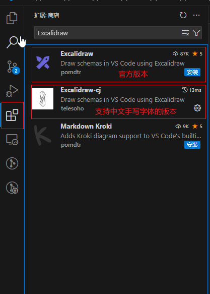

Excalidraw 存储

# 如何使用本仓库并使用仓库画画呢
1. 下载VsCode

    https://code.visualstudio.com/download

2. 安装插件(本仓库使用的是支持中文手写体的Excalidraw-cj)

    

3. clone 项目
    ```
    git clone https://github.com/XujinCoding/Excalidraw.git
    ```

    打开文件就可以尽情画图了
# 文件目录介绍
1. resource:这个目录下存储的是个人认为比较好的素材
    
    其中personal-material-library.excalidrawlib是个人素材库

2. starboss 是Boss系统中的图, 详情见图名
